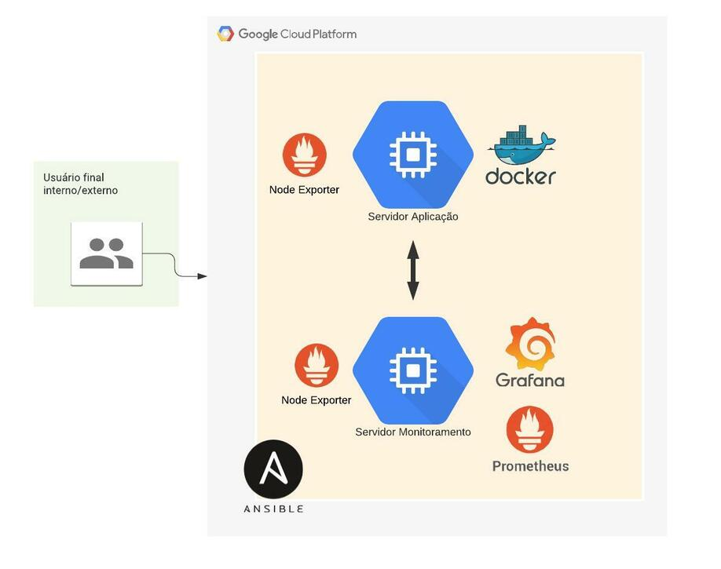

## Projeto de Monitoração Simples utilizando a Stack Prometheus e Grafana

O Prometheus é um sistema completo de monitoramento para serviços e aplicações. Ele coleta as métricas de seus alvos em determinados intervalos, avalia expressões de regras, exibe os resultados e também pode acionar alertas se alguma condição for observada como verdadeira. Já o Grafana é uma ferramenta open source de visualização que pode ser utilizada para exibir dados de várias fontes diferentes, as mais comuns são: Graphite, InfluxDB, ElasticSearch e nesse caso do exemplo por meio do Prometheus.

Arquitetura da Solução



A arquitetura do sistema é bem simples, dentro das duas máquinas na GCP serão instalados dois Node Exporters, além disso será instalado no servidor da aplicação do Cadvisor, ferramenta responsável por coletar métricas dos containers em execução, com isso teremos a métricas suficientes para monitorar o ambiente. Passando para o Prometheus iremos coletar essas métricas e disponibilizar para o Grafana; já foi incluso no mesmo por meio do Ansible alguns Dashboards customizados afim de ganhar tempo e poupar execuções manuais.

1. **Deploy da Stack**

Os passos abaixo foram executados para provisionar a infraestrutura

```bash
git clone https://github.com/leandro-matos/4linux-desafio-pratico
cd 4linux-desafio-pratico
```

Estrutura de Diretórios:
```bash
├── ansible
│   └── roles
│       ├── grafana
│       │   ├── defaults
│       │   ├── handlers
│       │   ├── tasks
│       │   ├── templates
│       │   ├── tests
│       │   └── vars
│       ├── node-exporter
│       │   ├── defaults
│       │   ├── handlers
│       │   ├── tasks
│       │   ├── templates
│       │   ├── tests
│       │   └── vars
│       └── prometheus
│           ├── defaults
│           ├── handlers
│           ├── meta
│           ├── tasks
│           ├── templates
│           ├── tests
│           └── vars
└── grafana-dashboards
    ├── cadvisor
    └── node-exporter

```
