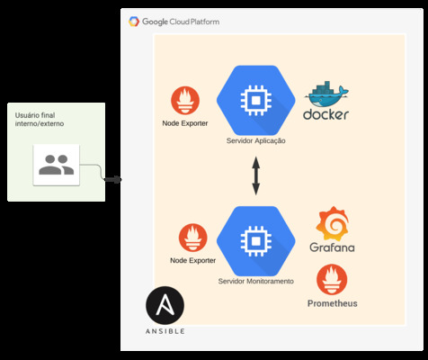

## Projeto de Monitoração Simples utilizando a Stack Prometheus e Grafana

O Prometheus é um sistema completo de monitoramento para serviços e aplicações. Ele coleta as métricas de seus alvos em determinados intervalos, avalia expressões de regras, exibe os resultados e também pode acionar alertas se alguma condição for observada como verdadeira. Já o Grafana é uma ferramenta open source de visualização que pode ser utilizada para exibir dados de várias fontes diferentes, as mais comuns são: Graphite, InfluxDB, ElasticSearch e nesse caso do exemplo por meio do Prometheus.

Arquitetura da Solução



A arquitetura do sistema é bem simples, dentro das duas máquinas na GCP serão instalados dois Node Exporters, além disso será instalado no servidor da aplicação do Cadvisor, ferramenta responsável por coletar métricas dos containers em execução, com isso teremos a métricas suficientes para monitorar o ambiente. Passando para o Prometheus iremos coletar essas métricas e disponibilizar para o Grafana; já foi incluso no mesmo por meio do Ansible alguns Dashboards customizados afim de ganhar tempo e poupar execuções manuais.

1. **Deploy da Stack**

O primeiro passo é garantir que o Ansible e o git estejam instalados no servidor do monitoramento, após isso pegar a chave fornecida para conseguir se conectar diretamente a instância de cliente para execução dos playbooks.

```bash
sudo echo "deb http://ppa.launchpad.net/ansible/ansible/ubuntu trusty main" | tee /etc/apt/sources.list
sudo apt-key adv --keyserver keyserver.ubuntu.com --recv-keys 93C4A3FD7BB9C367
sudo apt update 
sudo apt install git ansible -y
ssh-add chave.pem
ssh -i chave.pem 35.222.63.47
``

Os passos abaixo foram executados para provisionar a infraestrutura

```bash
git clone https://github.com/leandro-matos/4linux-desafio-pratico
cd 4linux-desafio-pratico/ansible
```
Dentro do arquivo `inventory.yml` garantir que estejam os IP's fornecidos para o servidor e client.

Logo após basta executar o comando para execução do playbook, assim a infraestrutura será provisionada.

```bash
ansible-playbook -i inventory.yml playbook.yml
```

Estrutura de Diretórios:
```bash
├── ansible
│   └── roles
│       ├── grafana
│       │   ├── defaults
│       │   ├── handlers
│       │   ├── tasks
│       │   ├── templates
│       │   ├── tests
│       │   └── vars
│       ├── node-exporter
│       │   ├── defaults
│       │   ├── handlers
│       │   ├── tasks
│       │   ├── templates
│       │   ├── tests
│       │   └── vars
│       └── prometheus
│           ├── defaults
│           ├── handlers
│           ├── meta
│           ├── tasks
│           ├── templates
│           ├── tests
│           └── vars
└── grafana-dashboards
    ├── cadvisor
    └── node-exporter
```

2. **Configurações e Acessos**

É necessário a execução do cadvisor na máquina onde está rodando as aplicações, optei por rodar um container dentro da instância. Outra forma seria através do docker-compose, conforme a doc do Prometheus: https://prometheus.io/docs/guides/cadvisor/

```
sudo docker run \
  --volume=/:/rootfs:ro \
  --volume=/var/run:/var/run:rw \
  --volume=/sys:/sys:ro \
  --volume=/var/lib/docker/:/var/lib/docker:ro \
  --publish=8080:8080 \
  --detach=true \
  --name=cadvisor \
  google/cadvisor:latest
```

A última etapa é incluir o Prometheus como Datasource no painel de administração do Grafana. Após o primeiro login, na tela inicial, basta procurar o data source Prometheus e clicar em Select, dessa forma ele ficará habilitado, basta inserir a URL do Prometheus `127.0.0.1:9090` e clicar no Save & Test, o retorno deve ser Data Source is working:

Links de Acesso:
- [x] Prometheus: **http://35.239.202.143:9090/**
- [x] NodeExporter Metrics: **http://35.239.202.143:9100/metrics**
- [x] Grafana (user: admin, senha: 4linux): **http://35.239.202.143:3000**
- [x] Cadvisor: **http://35.222.63.47:8080/**


#### Implementações e melhorias no projeto:
Implementação de camada de alertas para o monitoramento eficiente tais como AlertManager e possíveis integrações com (Slack, RocketChat, etc)

Incluir automaticamente o DataSource do Prometheus; houve há erro na execução da etapa do Playbook no SO Debian, portanto é necessário adicionar manualmente o Datasource do Prometheus. Esse mesmo comportamento não foi apresentado em um servidor Ubuntu, dessa forma deixei comentado entre as linhas 57 e 68 no arquivo `main.yml` na roles do Grafana.

Instrumentação das aplicações para que as mesmas disponham de métricas para coleta do Prometheus, não tive tempo suficiente para estudar as métricas e conseguir alterar dentro da aplicação. A documentação mostra alguns exemplos de como efetuar esses passos: https://prometheus.io/docs/instrumenting/clientlibs/. 

Nesse caso há exemplos em Python e Node, expondo essas métricas, é possível depois montar Dashboards mais eficientes com detalhes do fluxo da aplicação, outra situação que podeseria ser interessante para esse cenário e a utilização do ElasticStack e seus recursos de APM.

